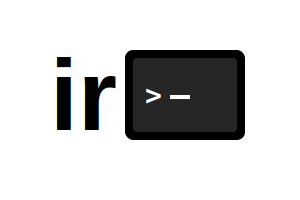

# Ira

A minimal terminal multiplexer built for personal use and learning.

## Why Ira?

I've used tools like tmux and zellij, but found them overly complex with too many features and configuration options. Ira is my solution - a terminal multiplexer stripped down to exactly what I need, nothing more.

### What I Actually Need

- **Easy session management** - Simple, intuitive session handling
- **Harpoon-style window switching** - Quick navigation inspired by ThePrimeagen's workflow
- **Prefix-based commands** - Familiar keybindings for pane management
- **Session templates** - Reproducible workspace configurations
- **No Vim/Neovim plugins required** - Works seamlessly without extra setup
- **A learning experience** - Understanding terminal multiplexers from the ground up

**Note:** This is not trying to replace tmux or zellij. This is a personal implementation for personal needs and learning.

## Architecture

Ira consists of two components:
- **irad** - The daemon that manages terminal sessions
- **ira** - The client that communicates with the daemon via gRPC

The daemon binary is embedded into the client, so you only need to run the client.

## Prerequisites

- [Nix](https://nixos.org/download.html) with flakes enabled
- That's it! All other dependencies are managed by Nix

## Setup

1. Clone the repository:
```bash
git clone git@github.com:cchirag/ira.git
cd ira
```

2. Enter the development environment:
```bash
nix develop
```

3. Generate gRPC code and setup the project:
```bash
task setup
```

## Development

### Available Commands
```bash
# Build the client (automatically builds and embeds the daemon)
task build:client

# Run the client (daemon is embedded)
task run:client

# Build only the daemon
task build:daemon

# Run only the daemon (for testing)
task run:daemon

# Generate gRPC code
task gen

# Clean build artifacts
task clean

# See all available tasks
task --list
```

### Quick Start
```bash
# Just run the client - the daemon is automatically embedded
task run:client
```

## Philosophy

**Clarity over complexity.** Every feature must justify its existence. If it doesn't serve the core goals above, it doesn't belong in Ira.

## License

MIT License - see [LICENSE](LICENSE) file for details.
